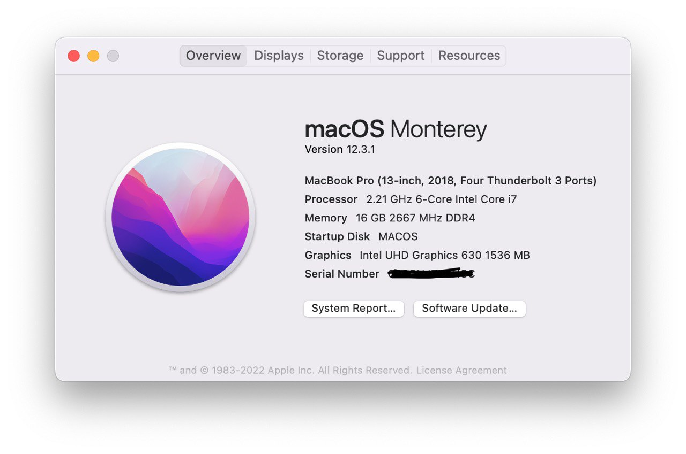

# ROG Zephyrus M GM501GS Running macOS Monterey 12.3.1
### 

### Specs

- OS: Arch Linux, Windows 11, Kali Linux, macOS Monterey

- CPU: Intel® Core™ i7-8750H Processor 2.2 GHz (9M Cache, up to 4.1 GHz)
- GPU: Intel UHD 630
- Chipset: HM370
- RAM: 16GB DDR4
- Storage: 1TB 5400RPM 2.5" SATA FireCuda SSHD 512GB M.2 NVMe™ PCIe® 3.0 x4 SSD 
- WIFI: Intel Wireless 9560 AC
- Camera: USB2.0 HD UVC WebCam
- Audio/Mic: Realtek HD Audio ALC3328 (ALC294 codec)
- Keyboard & Trackpad - ELAN/SA473I-12A4 (ELAN1201)

### Installing

1. Use [USBToolBox](https://github.com/USBToolBox/tool/) to customize the injector kext
2. Fill the SMBIOS in `config.plist`(or you can do this after installed), could generate by [GenSMBIOS](https://github.com/corpnewt/GenSMBIOS)
3. Disable discrete graphics in ROG GAMING CENTER

### Credits

Thanks to [danikpanik](https://github.com/danikpanik/Asus_Zephyrus_M_GM501GS_Monterey).

